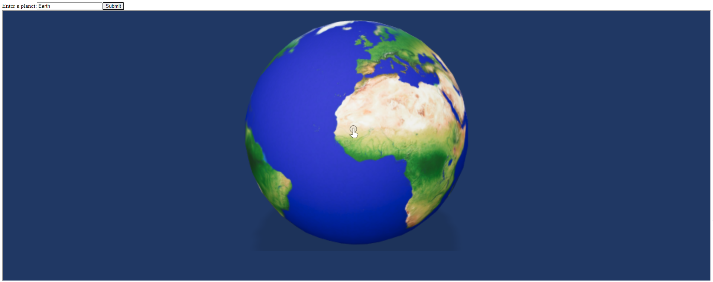
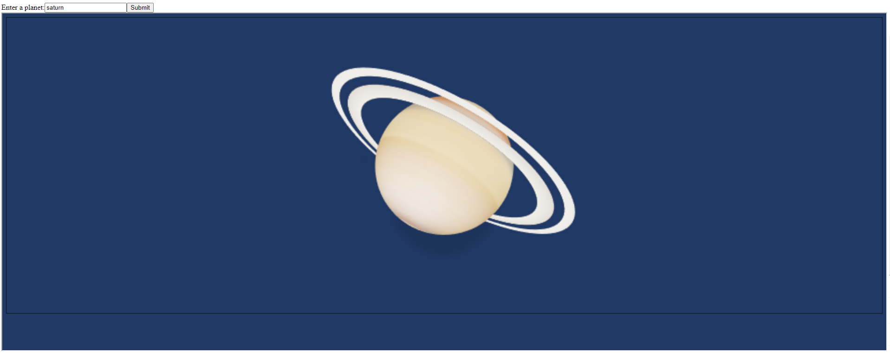

# React-echoAR-demo-Planets
React demo with echoAR.  Type a planet from our solar system into the input field to see it appear in AR

## Register
Don't have an API key? Make sure to register for FREE at [echoAR](https://www.echoar.xyz/).

## Setup
1. Clone [echoAR-ARjs-Planets-Demo](https://github.com/dylandawk/echoAR-ARjs-Planets-Demo/)
2. Download [Node and Node Package Manager(npm)](https://nodejs.org/en/)
3. [Download and set up ngrok](https://ngrok.com/download)

### Terminal
4. In the terminal, navigate to the ```echoAR-ARjs-Planets-Demo/``` directory and enter ```$ npm init```
5. Next, enter ```$ npm install express react react-dom``` to install relevant packages

### echoAR Console
6. Add [Earth](https://poly.google.com/view/0nEWYSdUqRq) to your echoAR console
7. Add the [other planets (except pluto)](https://poly.google.com/user/6NjDF67XHu0)
8. Once added, copy the short URL generated for each model and use them to replace the ```<Your [planet] short url here>``` in [PlanetDemo.jsx](./app/components/PlanetDemo.jsx)
  * optional: add entry-IDs to replace ```<your [planet] entry id here>```

## Run
1. In terminal, enter ```npm start``` to serve the application on a local host. The terminal will display a port number that you can use in the next steps
2. In a separate terminal window navigate to ```<path>/<to>/ngrok``` and enter ```http <port number>```. The terminal will list a number of urls - the important one is the url beginning with  ```https```
3. To view on computer or mobile device, open up web browser and enter the ngrok url.


## Learn More
Refer to our [documentation](https://docs.echoar.xyz/unity/) to learn more about how to use Unity and echoAR.

## Support
Feel free to reach out at [support@echoAR.xyz](support@echoAR.xyz) or join our [support channel on Slack](https://join.slack.com/t/echoar/shared_invite/enQtNTg4NjI5NjM3OTc1LWU1M2M2MTNlNTM3NGY1YTUxYmY3ZDNjNTc3YjA5M2QyNGZiOTgzMjVmZWZmZmFjNGJjYTcxZjhhNzk3YjNhNjE).

## Screenshots



Demo created by [Dylan Dawkins](https://github.com/dylandawk/).

